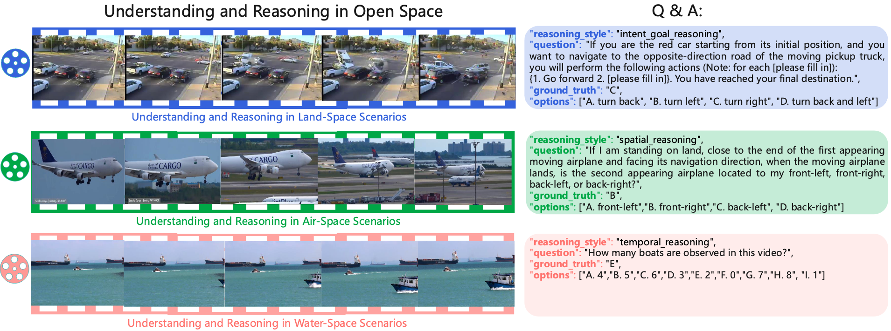
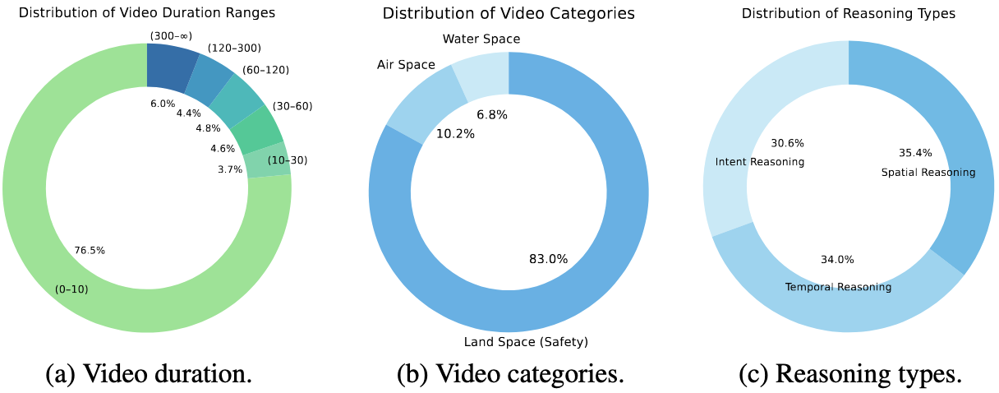
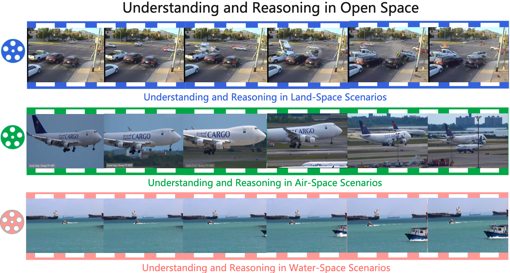
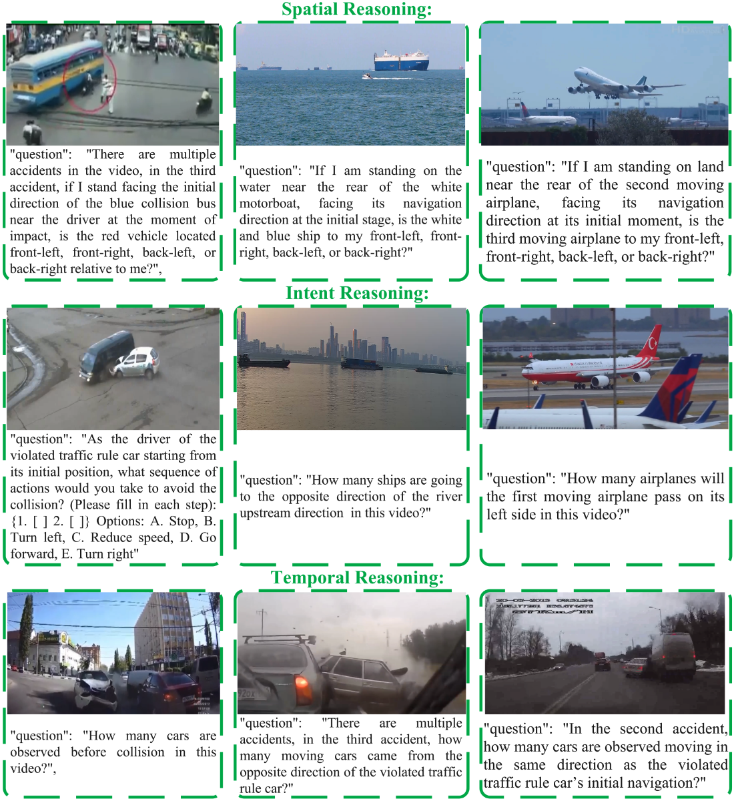
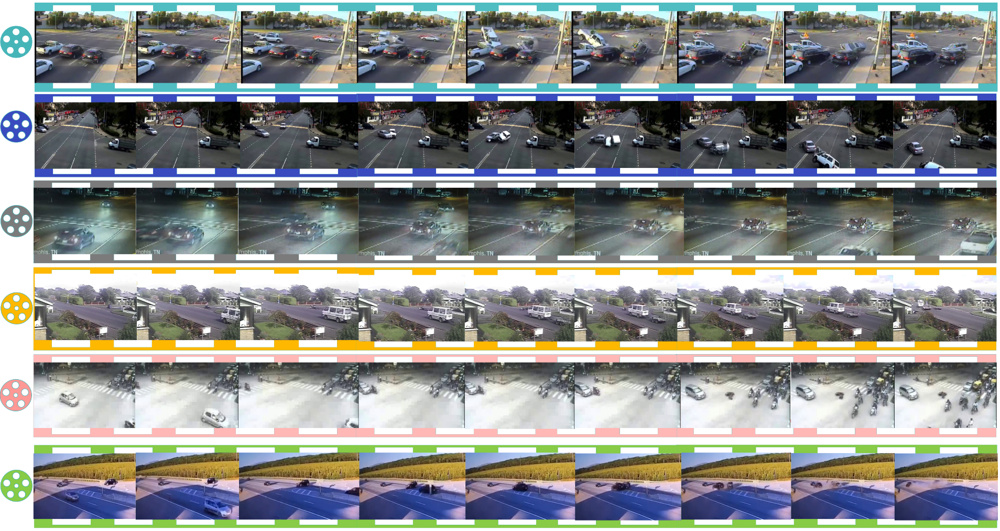

<div align="center">
  <a href="https://github.com/SafeRL-Lab/Open-Space-Reasoning">
     
  </a>
  
<h1 align="center" style="font-size: 30px;"><strong><em>M4R</em></strong>:  Measuring Massive Multimodal Understanding and Reasoning in Open Space</h1>
<p align="center">
    <!-- <a href="./docs/M4R_paper.pdf">Paper</a> -->
    <!-- · -->
    <a href="https://open-space-reasoning.github.io/">Website</a>
    ·
    <a href="https://github.com/SafeRL-Lab/Open-Space-Reasoning/">Code</a>
    ·
    <a href="https://open-space-reasoning.github.io/#leaderboard-land-air">Leaderboard</a>
    ·
    <a href="https://huggingface.co/datasets/Open-Space-Reasoning/Benchmark">Dataset</a>
    ·
    <a href="https://huggingface.co/datasets/Open-Space-Reasoning/M4R-zip">Dataset-Zip</a>
    ·
    <a href="https://github.com/SafeRL-Lab/Open-Space-Reasoning/issues">Issue</a>
  </p>
</div>

---

# Content
  - [Leaderboard](#Leaderboard)
  - [About the Dataset](#About-the-Dataset)
    - [Dataset Format](#Dataset-Format)
    - [Dataset Distribution](#Dataset-Distribution)
    - [Three Space Settings](#Three-Space-Settings)
    - [Reasoning Settings](#Reasoning-Settings)
    - [One Example in Land Space Settings](#One-Example-in-Land-Space-Settings)
  - [Installation](#Installation)
  - [Download Dataset](#Download-Dataset)
  - [Basic Usage](#Basic-Usage)
  - [Citation](#Citation)
  - [Acknowledgment](#Acknowledgment)

 ---

<!--<p align="center" width="80%">

</p>
# M4R: Measuring Massive Multimodal Understanding and Reasoning in Open Space
-->

## Leaderboard

### Evaluation of Open Space (Land, Water, Air) domains using M4R benchmarks

Each reported number corresponds to the average score (overall, temporal, spatial, and intent reasoning).

| Difficulty | Models                                                                         | Size | Over. Avg. | Temporal | Spatial | Intent |
| ---------- | ------------------------------------------------------------------------------ | ---- | ---------- | -------- | ------- | ------ |
| Hard       | [GPT 4o](https://arxiv.org/pdf/2410.21276)                                     | -    | 22.21      | 24.92    | 27.14   | 13.80  |
| Hard       | [Gemini 2.5 Pro 🥇](https://deepmind.google/models/gemini/pro/)                | -    | **31.01**  | 38.18    | 30.08   | 25.20  |
| Hard       | [Gemini 1.5 Pro](https://arxiv.org/pdf/2403.05530)                             | -    | 19.07      | 22.53    | 21.57   | 17.25  |
| Hard       | [Claude 3.5](https://www.anthropic.com/news/claude-3-5-sonnet)                 | -    | 28.89      | 32.84    | 29.18   | 23.41  |
| Hard       | [InternVL2.5](https://huggingface.co/OpenGVLab/InternVL2_5-26B)                | 26B  | 22.45      | 25.33    | 27.42   | 12.64  |
| Hard       | [InternVL2.5](https://huggingface.co/OpenGVLab/InternVL2_5-8B)                 | 8B   | 20.39      | 21.30    | 29.41   | 11.42  |
| Hard       | [InternVL2.5](https://huggingface.co/OpenGVLab/InternVL2_5-4B)                 | 4B   | 17.31      | 17.39    | 23.04   | 13.13  |
| Hard       | [LLaVA Next](https://huggingface.co/lmms-lab/llava-next-qwen-32b)              | 32B  | 17.83      | 11.28    | 26.09   | 10.10  |
| Hard       | [LLaVA Video](https://huggingface.co/lmms-lab/LLaVA-Video-7B-Qwen2)            | 7B   | 17.35      | 13.02    | 27.49   | 10.18  |
| Hard       | [LLaVA OneVision](https://huggingface.co/lmms-lab/llava-onevision-qwen2-7b-ov) | 7B   | 14.27      | 9.55     | 24.74   | 10.15  |
| Hard       | [Qwen2.5 VL](https://huggingface.co/Qwen/Qwen2.5-VL-32B-Instruct)              | 32B  | 19.39      | 13.19    | 27.85   | 14.05  |
| Hard       | [Qwen2.5 VL](https://huggingface.co/Qwen/Qwen2.5-VL-7B-Instruct)               | 7B   | 20.34      | 12.31    | 28.40   | 15.48  |
| | | | | | | |
| Medium     | [GPT 4o 🥇](https://arxiv.org/pdf/2410.21276)                                  | -    | **41.21**  | 44.89    | 47.03   | 28.19  |
| Medium     | [Gemini 2.5 Pro](https://deepmind.google/models/gemini/pro/)                   | -    | 41.07      | 41.31    | 48.33   | 33.06  |
| Medium     | [Gemini 1.5 Pro](https://arxiv.org/pdf/2403.05530)                             | -    | 37.13      | 40.69    | 43.81   | 31.06  |
| Medium     | [Claude 3.5](https://www.anthropic.com/news/claude-3-5-sonnet)                 | -    | 37.99      | 36.46    | 47.34   | 31.09  |
| Medium     | [InternVL2.5](https://huggingface.co/OpenGVLab/InternVL2_5-26B)                | 26B  | 36.39      | 37.85    | 47.51   | 27.55  |
| Medium     | [InternVL2.5](https://huggingface.co/OpenGVLab/InternVL2_5-8B)                 | 8B   | 35.44      | 39.85    | 51.07   | 18.98  |
| Medium     | [InternVL2.5](https://huggingface.co/OpenGVLab/InternVL2_5-4B)                 | 4B   | 36.53      | 31.21    | 45.36   | 32.68  |
| Medium     | [LLaVA Next](https://huggingface.co/lmms-lab/llava-next-qwen-32b)              | 32B  | 21.07      | 13.57    | 33.08   | 14.24  |
| Medium     | [LLaVA Video](https://huggingface.co/lmms-lab/LLaVA-Video-7B-Qwen2)            | 7B   | 24.04      | 19.33    | 30.50   | 19.72  |
| Medium     | [LLaVA OneVision](https://huggingface.co/lmms-lab/llava-onevision-qwen2-7b-ov) | 7B   | 17.76      | 17.81    | 24.71   | 17.12  |
| Medium     | [Qwen2.5 VL](https://huggingface.co/Qwen/Qwen2.5-VL-32B-Instruct)              | 32B  | 29.93      | 23.34    | 41.94   | 25.82  |
| Medium     | [Qwen2.5 VL](https://huggingface.co/Qwen/Qwen2.5-VL-7B-Instruct)               | 7B   | 28.79      | 22.18    | 34.64   | 22.89  |
| | | | | | | |
| Easy       | [GPT 4o](https://arxiv.org/pdf/2410.21276)                                     | -    | 45.01      | 55.33    | 38.08   | 43.72  |
| Easy       | [Gemini 2.5 Pro 🥇](https://deepmind.google/models/gemini/pro/)                | -    | **59.36**  | 61.16    | 54.51   | 58.09  |
| Easy       | [Gemini 1.5 Pro](https://arxiv.org/pdf/2403.05530)                             | -    | 48.05      | 53.22    | 47.85   | 45.37  |
| Easy       | [Claude 3.5](https://www.anthropic.com/news/claude-3-5-sonnet)                 | -    | 50.14      | 53.28    | 48.51   | 46.40  |
| Easy       | [InternVL2.5](https://huggingface.co/OpenGVLab/InternVL2_5-26B)                | 26B  | 55.08      | 58.41    | 53.46   | 44.45  |
| Easy       | [InternVL2.5](https://huggingface.co/OpenGVLab/InternVL2_5-8B)                 | 8B   | 51.03      | 53.64    | 54.52   | 42.20  |
| Easy       | [InternVL2.5](https://huggingface.co/OpenGVLab/InternVL2_5-4B)                 | 4B   | 48.93      | 46.55    | 52.31   | 43.65  |
| Easy       | [LLaVA Next](https://huggingface.co/lmms-lab/llava-next-qwen-32b)              | 32B  | 35.32      | 31.22    | 40.09   | 34.34  |
| Easy       | [LLaVA Video](https://huggingface.co/lmms-lab/LLaVA-Video-7B-Qwen2)            | 7B   | 30.44      | 29.41    | 34.12   | 31.64  |
| Easy       | [LLaVA OneVision](https://huggingface.co/lmms-lab/llava-onevision-qwen2-7b-ov) | 7B   | 31.10      | 29.46    | 33.78   | 29.88  |
| Easy       | [Qwen2.5 VL](https://huggingface.co/Qwen/Qwen2.5-VL-32B-Instruct)              | 32B  | 48.35      | 50.68    | 47.82   | 44.97  |
| Easy       | [Qwen2.5 VL](https://huggingface.co/Qwen/Qwen2.5-VL-7B-Instruct)               | 7B   | 37.97      | 38.87    | 33.20   | 36.45  |

More results can be found at the link: [https://open-space-reasoning.github.io/](https://open-space-reasoning.github.io/)


## About the Dataset:
This benchmark includes approximately 2,000 videos and 19,000 human-annotated question-answer pairs, covering a wide range of reasoning tasks (as shown in Figure 1). We provide a **sample set (approximately 4K examples)** for efficiency evaluation, randomly selected from the **full dataset (19K examples)**. All annotations were performed by highly educated annotators, each holding at least a master's degree in engineering-related fields such as mathematics or computer science. The dataset features a variety of video lengths, categories, and frame counts, and spans three primary open-space reasoning scenarios: **land space**, **water space**, and **air space**. An overview of the dataset’s characteristics is shown in Figure 2, which illustrates the distributions of video duration, domain coverage, and reasoning styles. During annotation, we first design the hard-level tasks and label each question with the ground-truth answer. Based on these, we then construct the medium and easy tasks. The primary differences between difficulty levels lie in the number and types of answer choices. Details of the annotation procedure and difficulty levels are provided in our [paper](https://open-space-reasoning.github.io/static/papers/M4R_paper.pdf).

### Dataset Format:

```jsonc
{
  "id": ,
  "dataset": "str",              // e.g., sub dataset filename
  "scene_name": "str",           // e.g., video filename
  "reasoning_style": "str",      // e.g., temporal_reasoning, intent_goal_reasoning, etc.
  "question": "str",             // The reasoning question related to the scene
  "ground_truth": "str",         // Correct answer key (e.g., "A", "B", etc.)
  "options": ["str", "str", "str", "str", "str", "str"]  // Multiple-choice options
}
```

One example from air space:
```jsonc
  {
    "id": 1,
    "dataset": "air_space_long",
    "scene_name": "air_space_long_1.mp4",
    "reasoning_style": "intent_goal_reasoning",
    "question": "How many moving airplanes are observed in this video?",
    "ground_truth": "A",
    "options": [
      "E. [0,1]",
      "C. [8,9]",
      "A. [4,5]",
      "D. [6,7]",
      "B. [10,11]",
      "F. [2,3]"
    ]
  }
```

 <div align=center>
  
 </div>
<div align=center>
<center style="color:#000000;text-decoration:underline">Figure 1.  A question and answer example: For each open-space reasoning setting, we include three
types of video lengths: short, medium, and long. Each video length includes tasks designed to
evaluate temporal reasoning, spatial reasoning, and intent reasoning.</center>
 </div>

 
### Dataset Distribution:
 <div align=center>
  
 </div>
<div align=center>
<center style="color:#000000;text-decoration:underline">Figure 2. Distribution of video and task properties in the M4R benchmark.</center>
 </div>


### Three Space Settings

<div align=center>
  
 </div>
<div align=center>
<center style="color:#000000;text-decoration:underline">Figure 3. Examples of multimodal Understanding and Reasoning in Open-Space Scenarios.</center>
 </div>

### Reasoning Settings:

 <div align=center>
  
 </div>
<div align=center>
<center style="color:#000000;text-decoration:underline">Figure 4.  Examples of reasoning question settings in M4R across three key reasoning types: Temporal
Reasoning, which involves understanding event sequences and motion over time; Spatial Reasoning,
which focuses on relative positioning and orientation in space; and Intent Reasoning, which evaluates
understanding of goal-directed behaviors and decision-making in dynamic environments..</center>
 </div>

 ### One Example in Land Space Settings:

 <div align=center>
  
 </div>
<div align=center>
<center style="color:#000000;text-decoration:underline">Figure 5.  Land-space traffic accident scenarios for open-space video understanding and reasoning include
  <span style="color:cyan;">intersection collisions</span>,
  <span style="color:blue;">urban road accidents</span>,
  <span style="color:gray;">nighttime incidents</span>,
  <span style="color:orange;">rural road accidents</span>,
  <span style="color:pink;">snow-covered road collisions</span>, and
  <span style="color:green;">freeway accidents</span>.</center>
 </div>
 
## Installation

For development, you can install the package by cloning the repository and running the following command:
```bash
pip install uv
git clone git@github.com:SafeRL-Lab/m4r.git
cd m4r
uv venv dev
source dev/bin/activate
uv pip install -e .
uv pip install -U "qwen-vl-utils"   
```

<!-- ```bash
uv venv -p python3.11.5 dev311
source dev311/bin/activate
uv pip install -e .
``` -->


## Download Dataset

You can download the dataset directly from our [Hugging Face repository](https://huggingface.co/datasets/Open-Space-Reasoning/Benchmark).
```
git lfs install
git clone https://huggingface.co/datasets/Open-Space-Reasoning/M4R
```
If you encounter any issues during the download, we also provide a zipped version for convenience:
[Download Dataset (ZIP)](https://huggingface.co/datasets/Open-Space-Reasoning/M4R-zip)


## Basic Usage

Here's a basic evaluation example:


> Download the dataset from [Hugging Face](https://huggingface.co/datasets/Open-Space-Reasoning/Benchmark), and set the dataset path to the corresponding task file. For example, specify the dataset path as `/your-dataset-path/land_space/short/hard/spatial_reasoning.json` in the task configuration file located at `/Open-Space-Reasoning/lmms_eval/tasks/land_space_short/land_space_hard.yaml`.


```bash
accelerate launch --num_processes=1 --main_process_port=12346 -m lmms_eval \
        --model qwen2_5_vl \
        --model_args=pretrained=Qwen/Qwen2.5-VL-7B-Instruct,max_pixels=12845056,use_flash_attention_2=False,interleave_visuals=True \
        --tasks land_space_hard \
        --batch_size 1 \
        --log_samples \
        --output_path /pasteur2/u/xhanwang/lmms-eval/outputs/land_space_hard/
```

Modify the following examples to test more models as the above script.
> More examples can be found in [examples/models](examples/models)

**Evaluation of OpenAI-Compatible Model**

```bash
bash examples/models/openai_compatible.sh
bash examples/models/xai_grok.sh
```

**Evaluation of vLLM**

```bash
bash examples/models/vllm_qwen2vl.sh
```

**Evaluation of LLaVA-OneVision**

```bash
bash examples/models/llava_onevision.sh
```

**Evaluation of LLaMA-3.2-Vision**

```bash
bash examples/models/llama_vision.sh
```

**Evaluation of Qwen2-VL**

```bash
bash examples/models/qwen2_vl.sh
bash examples/models/qwen2_5_vl.sh
```

**Evaluation of LLaVA on MME**

If you want to test LLaVA 1.5, you will have to clone their repo from [LLaVA](https://github.com/haotian-liu/LLaVA) and

```bash
bash examples/models/llava_next.sh
```

**Evaluation with tensor parallel for bigger model (llava-next-72b)**

```bash
bash examples/models/tensor_parallel.sh
```

**Evaluation with SGLang for bigger model (llava-next-72b)**

```bash
bash examples/models/sglang.sh
```

**Evaluation with vLLM for bigger model (llava-next-72b)**

```bash
bash examples/models/vllm_qwen2vl.sh
```

**More Parameters**

```bash
python3 -m lmms_eval --help
```

**Environmental Variables**
Before running experiments and evaluations, we recommend you to export following environment variables to your environment. Some are necessary for certain tasks to run.

```bash
export OPENAI_API_KEY="<YOUR_API_KEY>"
export HF_HOME="<Path to HF cache>" 
export HF_TOKEN="<YOUR_API_KEY>"
export HF_HUB_ENABLE_HF_TRANSFER="1"
export REKA_API_KEY="<YOUR_API_KEY>"
# Other possible environment variables include 
# ANTHROPIC_API_KEY,DASHSCOPE_API_KEY etc.
```

**Common Environment Issues**

Sometimes you might encounter some common issues for example error related to httpx or protobuf. To solve these issues, you can first try

```bash
python3 -m pip install httpx==0.23.3;
python3 -m pip install protobuf==3.20;
# If you are using numpy==2.x, sometimes may causing errors
python3 -m pip install numpy==1.26;
# Someties sentencepiece are required for tokenizer to work
python3 -m pip install sentencepiece;
```


## Citation
If you find the repository useful, please cite the study
``` Bash
@article{gu2025m4r,
  title={Measuring Massive Multimodal Understanding and Reasoning in Open Space},
  author={Gu, Shangding and Wang, Xiaohan and Ying, Donghao and Zhao, Haoyu and Yang, Runing and Li, Boyi and Jin, Ming and Pavone, Marco and Yeung-Levy, Serena and Wang, Jun and Song, Dawn and Spanos, Costas},
  journal={Github},
  year={2025}
}
```


## Acknowledgment

This repository is adapted from [lmms-eval](https://github.com/EvolvingLMMs-Lab/lmms-eval) for use in our benchmark. We thank the contributors of *lmms-eval* for their efforts and contributions.


